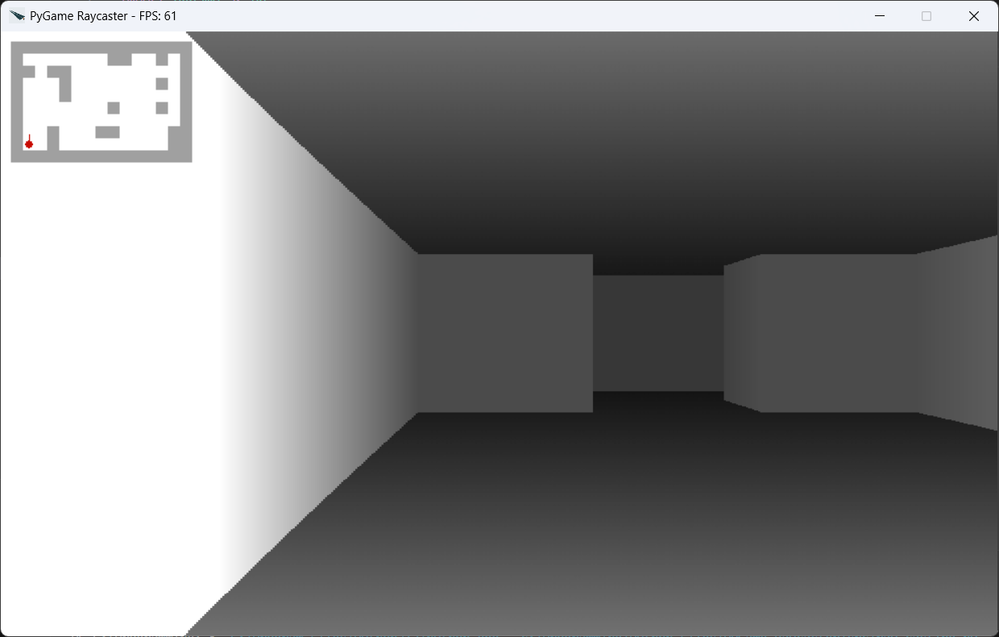
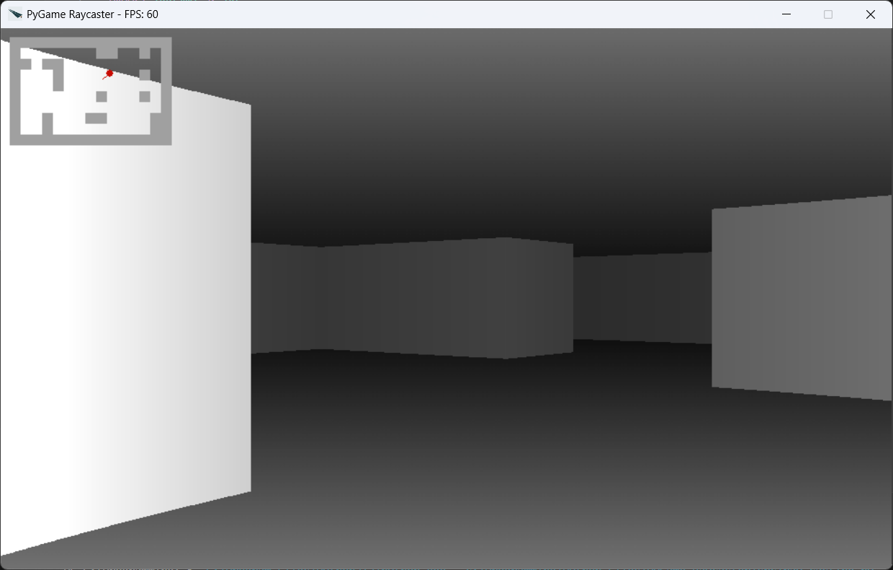

<div align="center">
  <h1>PyGame Raycaster</h1>
  <p>
  A 2.5D raycaster engine implemented in Python using PyGame. This project simulates a 3D environment using 2D raycasting techniques, inspired by classic games like Wolfenstein 3D.
 </p>
</div>
<br>

 
 

---

## Features
- Real-time Raycasting
- Basic collision detection
- Smooth keyboard controls (`WASD`)
- Customizable map grid
- Mimi map

---

## Prerequisites
- Python 3.X
- Pygame

---

## Installation

1. **Clone the repository**:
   ```bash
   git clone https://github.com/Anubhav-Mondal/PyGame-Raycaster.git
   ```

2. **Install dependencies**:
   ```bash
   pip install pygame
   ```

3. **Running the Project**:
   ```bash
   python src/raycaster.py
   ```

## Project Structure

- `src` : Source Code
- `asstes` : Resources
- `README.md` : Documentation